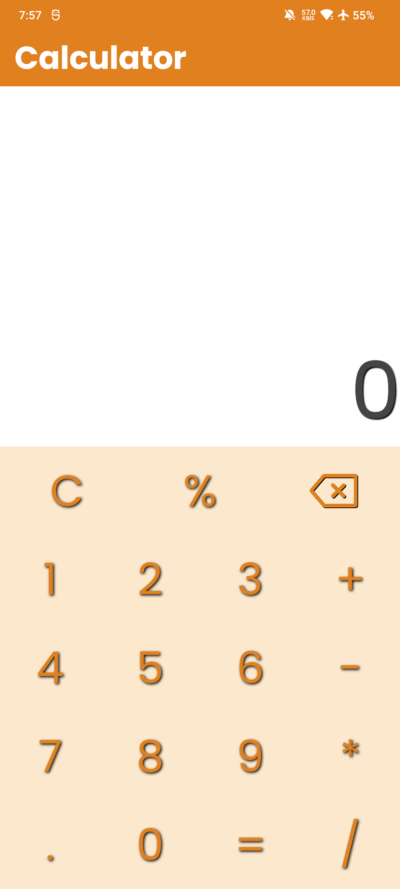
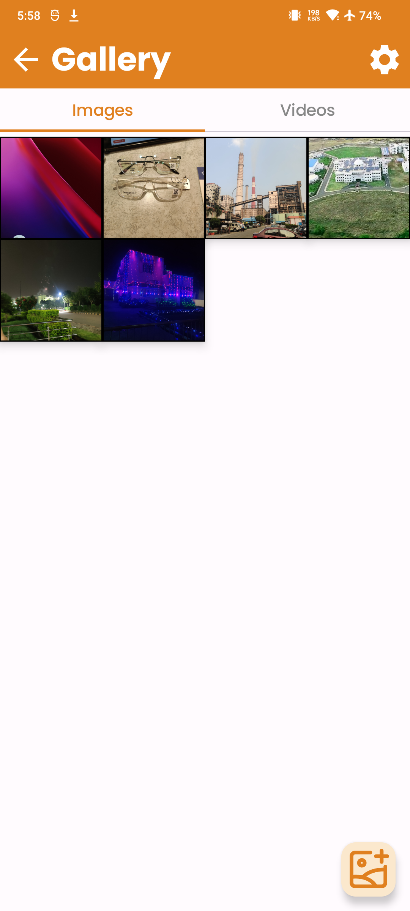
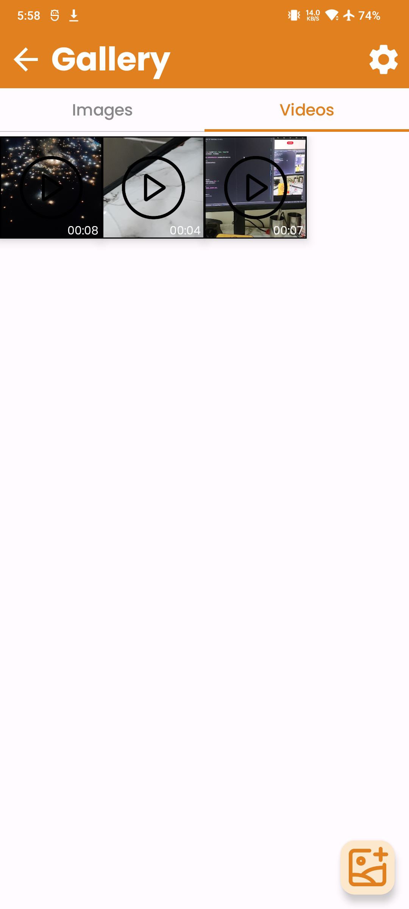

# Calculator Vault 

A secure **vault** disguised as a **calculator**. Enter a **PIN** to unlock hidden images!. Add your images and videos to the vault to keep them hidden, comes with a image and video viewer

## Features

**Disguised as a Calculator** – Functions like a real calculator, but unlocks a vault when the secret PIN is entered.  
**Secure Media Storage** – Moves selected images and videos to a **private directory** in internal storage.  
**Jetpack Compose UI** – Modern and smooth UI built with **Kotlin and Jetpack Compose**.  
**Photo Picker Integration** – Easily select images using the Android **PhotoPicker API**.  
**Reset PIN** – Option to reset the pin by answering a **security question**.

## Screenshots

Here are some screenshots:

<p>
  
  
  
</p>


## Installation

### Clone the Repository

```sh
git clone https://github.com/scifre/calculator-media-vault.git
cd calculator-vault
```

### Open in Android Studio

1. Open **Android Studio**
2. Click on **Open an Existing Project**
3. Select the `calculator-vault` folder
4. Wait for Gradle sync to complete

### Install Dependencies

Ensure you have the necessary dependencies by checking your `build.gradle.kts` file.

## Usage

1. **Launch the app** – It looks like a normal calculator.
2. **Enter your secret PIN** (pre-set or first-time setup).
3. **Vault opens** – You can now access your hidden images.
4. **Use the Photo Picker** to add new images to the vault.

## Technologies Used

- **Kotlin**
- **Jetpack Compose**
- **Photo Picker API**
- **LazyGridView for Image Display**
- **Android Storage API (Scoped Storage)**

## Contributing

Want to contribute? Feel free to submit a **Pull Request**!

## License

📜 This project is **open-source**, licensed under [MIT License](LICENSE).

